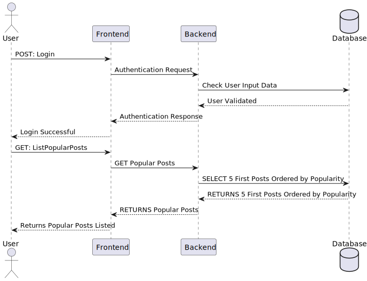

# US 006 - Development (Popular Posts Listing)

## 1. Requirements Engineering

### 1.1. User Story Description

As an organization employee, I want to change the current GetPopularPosts method to only get the first 5 most popular posts. Therefore, make API and Unit tests to cover the updated code. Finally, create a new PlantUML sequence diagram related to the *updated* "List Popular Post" feature.

### 1.2. Customer Specifications and Clarifications

**From the specifications document:**

>No customer specifications, as this is an increment for a feature that's already implemented in the solution.

### 1.3. Acceptance Criteria

* **AC1:** When users want to see the Popular posts, they must only see the first 5 most popular posts.
* **AC2:** API and Unit tests need to be produced as well.
* **AC3:** A sequence diagram related to the *updated* "List Popular Post" feature must be produced.
* **AC4:** A final SVG must be generated from the PlantUML diagram produced.

### 1.4. Found out Dependencies

* There is a dependency to "US003 Create a task category" since at least a task category must exist to classify the task being created.

### 1.5 Input and Output Data

**Input Data:**

* Make a request for the Popular posts
* Execute API and Unit tests
* PlantUML code to produce the diagram

**Output Data:**

* List of 5 most popular posts
* (In)Success of the tests
* PlantUML diagram in .puml
* Same representation on the diagram in .svg

### 1.6. Sequence Diagram (SD)

**List Popular Post Diagram.**

### 1.7 Other Relevant Remarks

* No relevant remarks.
